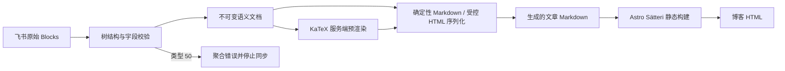

# 飞书富内容识别与博客渲染设计

日期：2026-07-15

状态：交互设计已确认，书面说明待审阅

## 1. 背景

当前博客通过 `scripts/feishu/blocks.mjs` 将飞书新版文档 Block 转成 Markdown，再由 Astro 内容集合生成静态文章页。已有转换器支持段落、1–6 级标题、列表、待办、引用、代码块、分隔线、图片、简单表格，以及粗体、斜体、删除线、行内代码和安全链接。

现有缺口会造成两类失败：

- `underline`、`text_color`、`background_color` 只生成 warning，公开正文退化成普通文字。
- 公式、高亮块、源同步块和引用同步块不在支持范围内，任一出现都会令整篇文档转换失败。

本轮要在不改变静态发布架构、不降低同步事务安全性的前提下，准确识别并渲染这些常见飞书格式。

## 2. 已确认决策

1. 引用同步块暂不支持；识别到后明确失败，不跨文档拉取源内容，也不输出占位块。
2. 源同步块在博客中显示轻边界和小型“同步内容”标记，不做无痕展开或强卡片化。
3. 公式与普通文字混排时使用行内公式；一个普通段落唯一的非空元素是公式时使用块级公式。
4. 飞书颜色保留红、橙、黄、绿、蓝、紫、灰及深浅层级语义，但浅色、深色博客主题分别校准实际色值。
5. 采用独立的“飞书语义层”，将 API 结构识别、博客序列化和页面样式分开。
6. 公式在飞书同步阶段用 KaTeX 服务端预渲染，不迁移 Astro 7 当前默认的 Sätteri Markdown 处理器，也不在浏览器加载公式运行时脚本。

## 3. 目标与非目标

### 3.1 目标

- 准确识别并渲染源同步块、高亮块、公式、粗体、下划线、文字颜色、文字背景色、行内代码和链接。
- 保留当前已支持的斜体、删除线和基础块行为。
- 支持同一富文本元素上的多种样式组合，并产生确定性输出。
- 完整覆盖当前飞书枚举：文字颜色 1–7、文字背景色 1–15、高亮块背景色 1–15、高亮块边框色 1–7。
- 为浅色和深色博客主题提供可读的自适应颜色映射。
- 公式输出同时包含视觉 HTML 与 MathML，并在窄屏安全滚动。
- 继续执行严格的全量校验；任何内容损失风险都在公开文件替换前失败。
- 保持 `blocksToMarkdown()` 的调用方式、返回字段和媒体本地化链路兼容。

### 3.2 非目标

- 不支持类型 50 的引用同步块。
- 不在本轮支持 `mention_user`、`mention_doc`、提醒、内联文件、链接预览、画板、分栏或其他未列出的新 Block。
- 不将手写 Markdown/MDX 纳入新的飞书输入清洗策略；手写内容继续属于仓库受信内容。
- 不逐像素复制飞书编辑器色值；博客保留颜色语义和层级，同时优先保证主题一致性与可读性。
- 不引入客户端 KaTeX、MathJax 或文章页 JavaScript。
- 不修改飞书多维表格字段、文章 frontmatter、路由或发布工作流触发方式。

## 4. 飞书输入契约

实现以当前飞书新版文档 Block 结构为准：

| 内容 | 识别字段 | 当前枚举/结构 |
| --- | --- | --- |
| 高亮块 | `block_type: 19`、`callout` | 背景色 1–15、边框色 1–7、文字色 1–7、可选 `emoji_id`（缺省语义为 `gift`）、`children` |
| 源同步块 | `block_type: 49`、`source_synced` | 可选标题 `elements`、可选 `align`（1 左、2 中、3 右）、正文位于子孙 Block |
| 引用同步块 | `block_type: 50`、`reference_synced` | 均为可选的 `source_document_id`、`source_block_id` |
| 公式 | 文本元素 `equation` | 必填 KaTeX `content`、可选 `text_element_style` |
| 文字样式 | `text_element_style` | `bold`、`italic`、`strikethrough`、`underline`、`inline_code`、`text_color`、`background_color`、`link`、`comment_ids` |

旧版飞书结构文档只列出 14 档背景色；当前块结构已加入枚举 15（浅灰色）。实现与测试必须以当前 1–15 契约为准，不能从旧文档复制不完整映射。

## 5. 总体架构

### 5.1 原始 Block 校验

保留现有唯一 Page 根、父子一致、单一父节点、全部可达、无环、表格结构和媒体 token 校验。支持集合增加类型 19 和 49，且二者同时加入现有 `CONTAINER_BLOCK_TYPES`，允许合法 `children` 通过叶节点校验；类型 50 进入“已识别但明确不支持”的专用错误，不归入未知 Block。

### 5.2 飞书语义层

新增语义层，将所有当前支持的 Block 和富文本元素规范化成与飞书 API 字段解耦的不可变节点。语义节点只保留渲染需要的数据；`block_id` 仅进入诊断上下文，不写入 Markdown 或公开 HTML。

概念模型包括：

- `SemanticDocument`：按文档顺序保存顶层语义 Block。
- 文本类 Block：段落、标题、列表、待办、引用、代码。
- 媒体与结构类 Block：图片、分隔线、表格。
- 新容器 Block：`Callout`、`SourceSynced`。
- 行内节点：`TextRun`、`Equation`。
- `InlineStyle`：布尔强调样式、前景色、背景色与安全链接。

语义层负责验证，序列化层不得重新猜测飞书字段含义。

### 5.3 确定性序列化

序列化层从语义节点生成确定性 Markdown 和受控 HTML：

- 不含高亮块、源同步块或受控标题的文章保持默认模式：已支持基础块继续使用现有 Markdown，只有包含下划线、颜色或公式的行内节点使用受控 HTML。
- 文章任意位置出现高亮块、源同步块，或任一标题包含下划线、颜色、公式等受控行内节点时启用“受控文档模式”：整个正文输出为一个固定 `
`，其内部段落、标题、列表、待办、引用、代码、分隔线、图片、表格、嵌套容器与行内节点全部递归输出受控 HTML，不采用 Markdown 父级与原始 HTML 子级混合嵌套。
- 默认模式中，完全由旧样式组成的行内节点继续沿用当前 Markdown；只要某个行内节点包含下划线、颜色或公式，该节点的整套样式栈就使用受控 HTML，不能把 `**`、反引号等 Markdown 标记嵌在 HTML 标签内部等待二次解析。
- 进入受控文档模式后，所有正文标题统一输出固定 HTML 与标题元数据；只有整篇文章既无特殊容器、也无受控标题时，旧格式标题才继续沿用当前 Markdown。
- 下划线、颜色、容器和 KaTeX 输出使用固定标签、固定属性和枚举 class。
- 容器内图片继续生成现有结构化媒体占位符并登记 `mediaReferences`，同步层完成同样的本地路径替换；容器边界不能改变下载预算、去重或未解析占位符检查。
- 作者文字、链接属性、公式诊断和标签属性全部经过上下文对应的转义。
- 相同语义输入必须逐字节生成相同 Markdown。

这一边界保证纯旧格式文章继续得到当前 Markdown，同时彻底避开 Markdown 列表/引用/表格祖先与原始 HTML 容器混合嵌套的解析歧义。生产构建测试必须验证容器与列表双向嵌套，以及容器内引用、链接、强调、代码、表格和图片最终成为真实 HTML 元素，而不是原样 Markdown 文本。

### 5.4 页面样式

特殊内容样式集中在 `src/styles/feishu-content.css`，由文章布局导入。它只在 `.prose` 范围内生效，并复用博客现有主题 token、间距、圆角和正文宽度。受控文档 wrapper 本身不制造额外视觉层级，并为其直接子块补齐与现有 `.prose > * + *` 等价的垂直节奏。

## 6. 文件边界

| 文件 | 职责 |
| --- | --- |
| `scripts/feishu/blocks.mjs` | 保留 `blocksToMarkdown()` 公共入口、原始树校验和返回结构编排 |
| `scripts/feishu/semantics.mjs` | 新增；规范化 Block、富文本、颜色、公式、高亮块和同步块，生成不可变语义文档 |
| `scripts/feishu/markdown.mjs` | 新增；从语义文档生成确定性 Markdown、受控 HTML、KaTeX HTML/MathML 和媒体引用 |
| `scripts/feishu/sync.mjs` | 保持同步事务；调整已支持样式的 warning 汇总与公式错误上下文 |
| `src/styles/feishu-content.css` | 新增；公式、下划线、主题色板、高亮块和源同步块样式 |
| `src/layouts/PostLayout.astro` | 导入飞书内容样式和 KaTeX CSS，不增加客户端脚本 |
| `src/lib/feishu-markup.ts` | 新增；按默认 Markdown / 受控文档两种状态识别代码边界，并校验公式、标题和容器界面标记 |
| `src/lib/search.ts` | 识别受控公式/容器标记，避免 KaTeX HTML 与 MathML 在搜索文本中重复或泄露 class 名 |
| `src/lib/feishu-headings.ts` | 新增；严格提取受控标题元数据，生成与正文锚点一致的目录项 |
| `src/pages/posts/[...id].astro` | 存在受控标题元数据时使用其替代 Astro 自动 headings，否则保持原逻辑 |
| `package.json`、`package-lock.json` | 增加固定版本的 `katex` 依赖 |
| `tests/fixtures/feishu-legacy-document.json` | 新增不含本轮新格式的旧行为 golden fixture，用于逐字节兼容回归 |
| `tests/fixtures/feishu-rich-content.json` | 新增当前官方形态的脱敏富内容 fixture |
| `tests/*.test.mjs` | 覆盖语义、序列化、同步、搜索、样式和真实构建契约 |

Astro 7 当前默认使用 Sätteri；本设计不切换到 `@astrojs/markdown-remark`，因此 `astro.config.mjs` 无需为公式修改 Markdown processor。

## 7. 富文本规则

### 7.1 支持的样式

| 飞书样式 | 语义输出 |
| --- | --- |
| `bold` | `strong` 语义；纯旧样式节点沿用 Markdown，受控模式输出 `<strong>` |
| `italic` | `em` 语义；纯旧样式节点沿用 Markdown，受控模式输出 `<em>` |
| `strikethrough` | `del` 语义；纯旧样式节点沿用 GFM，受控模式输出 `<del>` |
| `underline` | 受控 `<u class="feishu-underline">` |
| `inline_code` | 纯旧样式节点保留现有安全 fence 选择；受控模式输出经过文本转义的 `<code>`，两种模式使用相同空白语义 |
| `text_color` | `feishu-text-color--<hue>` 枚举 class |
| `background_color` | `feishu-text-background--<tone>-<hue>` 枚举 class |
| `link.url` | 受控链接；仅允许 `http:`、`https:`、`mailto:`，拒绝凭据 |

`comment_ids` 是已知非视觉元数据，允许存在但不进入公开输出。未知的视觉样式键不能静默忽略，必须产生 `unsupported_text_style` 问题。

### 7.2 组合顺序

每个富文本元素按以下顺序由内到外组合：

1. 文本或公式叶节点。
2. 行内代码。
3. 粗体、斜体、删除线、下划线。
4. 文字颜色和文字背景色。
5. 链接。

该顺序保证链接永远是最外层交互元素，避免嵌套 `<a>`，也保证显式颜色能够作用于行内代码。纯旧样式节点可由 Markdown 表达同一语义；受控模式必须把整套顺序显式输出成 HTML。只包含空白的 `text_run` 保持原样，不制造空的强调标签。

### 7.3 链接行为

- 保持当前同窗口导航行为，不擅自增加 `target="_blank"`。
- URL 先尝试解码，再使用 `URL` 解析并执行协议与凭据校验。
- 文本、URL、括号和 Markdown 特殊字符继续使用现有确定性转义规则。
- 危险或缺失 URL 进入聚合错误，整篇不发布。

## 8. 颜色系统

### 8.1 语义映射

- `FontColor` 1–7 映射为红、橙、黄、绿、蓝、紫、灰。
- `FontBackgroundColor` 必须使用独立映射：1–6 为浅红、浅橙、浅黄、浅绿、浅蓝、浅紫，7 为中灰，8–13 为红、橙、黄、绿、蓝、紫，14 为灰，15 为浅灰。
- `CalloutBackgroundColor` 必须使用另一张独立映射：1–6 为浅红、浅橙、浅黄、浅绿、浅蓝、浅紫，7 为中灰，8–13 为中红、中橙、中黄、中绿、中蓝、中紫，14 为灰，15 为浅灰。两种 8–13 的官方层级不同，不能共用 tone 表。
- `CalloutBorderColor` 1–7 映射为七种边框色。
- 缺失颜色字段表示使用容器继承值或博客默认值；数值 `0`、负数、非整数和范围外值均无效。

### 8.2 主题自适应

由飞书文本/容器颜色字段生成的 HTML 只保存颜色语义 class，不保存飞书 RGB，也不由这些字段拼接内联 `style`；KaTeX 自身排版属性的例外见 9.2 和 12 节。CSS 为 `:root` 与 `:root[data-theme='dark']` 定义两套色板：

- 浅色主题使用较深的彩色文字和较浅的背景色。
- 深色主题使用较亮的彩色文字和受控的深色背景色。
- 当同一元素同时存在前景色和背景色时，使用成对 token 调整明度与色度，保留色相语义。
- 所有合法前景/背景组合以及高亮块默认文字组合进入自动对比度测试，普通文本目标不低于 4.5:1。

若某个飞书原始组合不能在主题中直接满足对比度，允许调整实际明度和色度，但不允许把红色改成另一色相，也不允许丢弃作者选择。

## 9. 公式

### 9.1 识别与显示模式

- 只将 `equation` 文本元素识别为公式；语言为 LaTeX 的代码块仍是代码，不误判为数学公式。
- `equation.content` 必须是非空字符串；空字符串或纯空白公式产生 `invalid_equation`。
- 只有 `block_type: 2` 的普通段落在忽略纯空白 `text_run` 后，唯一非空元素恰好是一个 `equation` 时，才生成块级公式；公式前后的纯空白元素不输出可见节点。
- 普通段落中存在任意其他非空元素或多个公式时生成行内公式。标题、列表项、待办、引用、表格行内上下文以及 `source_synced.elements` 中的公式始终为行内公式，即使它是唯一元素。
- `equation.text_element_style` 使用与文字相同的前景色、背景色、强调和链接校验；`inline_code` 对公式无效并作为结构错误报告。

### 9.2 服务端预渲染

`scripts/feishu/markdown.mjs` 使用 `katex.renderToString()` 生成静态 HTML，固定关键选项：

- `displayMode` 由上面的识别规则决定。
- `output: 'htmlAndMathml'`，兼顾视觉渲染和辅助技术。
- `throwOnError: true`，无效语法不渲染成红色源码。
- `trust: false`，禁止 `\includegraphics`、`\htmlClass`、`\htmlStyle` 等扩展信任能力。
- `strict: 'error'`，飞书未声明支持的非标准语法不静默通过。
- `maxSize: 20`、`maxExpand: 1000`，限制极端尺寸和宏展开。

在调用 KaTeX 前执行独立资源预算：每篇文章最多 200 个公式，每个公式源码最多 8 KiB UTF-8，每个预渲染结果最多 512 KiB UTF-8，一篇文章全部公式结果合计最多 4 MiB。计数或大小超限产生 `formula_budget_exceeded`；这些限制与 `maxSize`、`maxExpand` 分别约束输入数量、输入体积、输出体积和解析复杂度，不能相互替代。

`scripts/feishu/markdown.mjs` 在正式输出 Markdown 前先遍历不可变语义文档并预渲染全部公式，收集同一文档中的所有 KaTeX 解析或预算问题；确认没有公式错误后才进入最终序列化。每个解析错误转换为 `invalid_equation`，保留 slug 与内部 Block 定位信息，但不把未转义公式源码写入公开错误。公式 wrapper 带固定的行内/块级 class：块级公式局部横向滚动；行内公式使用 `inline-block`、`max-inline-size: 100%` 和局部横向滚动，超长时允许作为一个整体换行，但不能撑破正文或整页。正常短公式保持正文基线。

KaTeX 为排版会生成计算型内联 `style`，这是“序列化器不得拼接作者 CSS”的唯一例外。固定并锁定的 KaTeX 版本负责生成标签与属性；`trust: false` 拒绝 `\htmlStyle`、`\htmlClass`、`\htmlId`、`\htmlData`、`\includegraphics`、`\href` 等信任能力。KaTeX 核心语法中的安全数学颜色命令可以产生由 KaTeX 约束的颜色样式并只作用于公式子表达式；它不能注入任意 CSS 属性。测试必须锁定所有信任命令均失败，并检查升级依赖后输出边界没有扩大。

### 9.3 搜索文本

每个公式使用固定 `` wrapper，并在固定属性 `data-feishu-equation-source` 中保存“规范化公式源码的 UTF-8 字节经无 padding Base64URL 编码”的值。作者只影响这个固定属性的编码值，不能决定属性名或追加属性；编码字符集限制为 `[A-Za-z0-9_-]`。行内/块级只由固定 class 区分。

`src/lib/feishu-markup.ts` 提供一次线性、双状态的结构扫描：

- 默认 Markdown 状态识别可变长度 fenced code 与行内 code span；代码区间内禁止解释任何 `data-feishu-*` 标记。
- 在非代码区间识别到唯一、完整的 `
` 后切换为受控 HTML 状态，直到它的匹配闭标签；该状态按标签结构识别 `<pre>`/`<code>` 代码子树，绝不把 HTML 文本中的反引号、`~~~` 或 Markdown fence 当作状态边界。
- 两种状态都只在各自的非代码区间识别固定公式、标题和界面 wrapper；遇到真实公式 wrapper 时按同名 `` 深度跳过完整 KaTeX HTML/MathML 子树。
- 受控 wrapper 重复、未闭合，或受控文档外存在非空 HTML 尾部时明确失败；扫描器不能使用跨任意 KaTeX 嵌套内容的单个正则，也不能先用无上下文正则抽取标记。

`markdownToSearchText()` 在线尾规范化之后调用该扫描器：合法 Markdown code span/fence 按现有空白规则提取；受控 HTML `<pre>/<code>` 先严格解码文本实体，再应用同样的空白规则。两类代码内容都先应用现有 URL 移除语义再进入受保护片段，避免重构改变旧代码搜索结果。公式来源严格 Base64URL 解码并把一次 NFKC 规范化源码直接放入受保护片段；容器界面节点删除。随后对其余正文执行 URL 移除和通用 HTML 清理。非法编码、未闭合 wrapper 或重复来源属性必须明确失败，但任一代码状态中无论是合法还是畸形的伪标记都只作为代码正文，不能触发失败或内容删除。搜索索引不得同时保留 KaTeX 视觉 HTML 与 MathML，以免出现重复和噪声。

### 9.4 表格上下文

Markdown 表格单元格中的公式保持行内 wrapper。KaTeX 渲染完成后，所有上下文统一使用确定性 HTML 扫描器执行 Markdown 安全编码：文本节点和属性值中的字面量 `|`、CR、LF 分别写为 `&#124;`、`&#13;`、`&#10;`，标签内部用于分隔属性的结构性 CR/LF 规范化为空格。编码发生在 KaTeX 解析之后，因此不能改变多行公式及 `%` 注释的 TeX 语义；Base64URL 来源属性本身不含这些字符。

统一编码使表格免受列分隔符影响，也避免普通段落中的 inline HTML 被源码换行截断。受控 HTML 容器内的表格不依赖 GFM 分隔规则，但使用同一输出仍必须等价。真实构建用例覆盖“公式 + 粗体/下划线/颜色 + 链接”组合、含 `|` 的公式、多行公式和含 `%` 注释的公式，断言普通段落不断裂，表格列数、链接和公式结构正确。

### 9.5 标题、目录与锚点

Astro/Sätteri 会从最终标题节点的 `textContent` 生成 heading 文本与 ID；KaTeX 的 MathML、annotation 和视觉 HTML 会让同一公式重复参与该过程。受控文档模式中的标题也不会进入 Astro 的普通 Markdown headings。因此只要文章启用受控文档模式，序列化器就对该文章的全部正文标题启用受控标题协议：

- 所有标题输出固定 `<h1>`–`<h6>`，内部使用完整受控 HTML，不再交给 Sätteri 推导标题内容。
- 按文档顺序分配唯一 ID `feishu-heading-1`、`feishu-heading-2`……；该 ID 不含 `block_id` 或作者可控字符串。
- 固定属性 `data-feishu-heading-text` 保存目录纯文本的 UTF-8 无 padding Base64URL。纯文本由可见文字、行内代码内容和每个公式的一次 NFKC 规范化源码组成，去掉视觉样式与链接目标并折叠空白。
- `src/lib/feishu-headings.ts` 复用双状态扫描器，在 Markdown 和受控 HTML 各自的代码区间之外校验标题标签、深度、连续序号、唯一 ID 和严格 Base64URL，按原顺序返回 `{ depth, slug, text }`。发现部分标记、非法编码、重复序号或标签不匹配时构建失败；代码示例中的伪标题标记原样保留且不参与协议。
- 文章页存在受控标题时完全使用这组元数据替代 `render(post).headings`；不存在时保持 Astro 当前 headings。桌面和移动目录因此共享同一份纯文本与锚点。
- 搜索清理只读取公式 wrapper 的来源，不读取标题元数据属性，避免公式重复；标题的可见正文仍正常进入索引。

生产构建测试必须覆盖普通标题、含公式标题、受控容器内标题及重复标题文本，断言最终 `<h*>` ID 唯一、目录文字中的公式源码只出现一次、桌面/移动目录 `href` 均指向实际标题，且无受控标题的旧文章输出保持不变。

## 10. 高亮块

### 10.1 结构

- 类型 19 必须包含对象形态的 `callout`。
- `children` 按原顺序递归规范化。
- 子块只要属于博客现有支持范围即可渲染；任一未支持子块令整篇失败。
- 空高亮块仍输出可见容器，但不制造空段落。

### 10.2 输出

高亮块输出固定 `<aside class="feishu-callout …">`，附加背景、边框和默认文字色 class。它采用柔和底色、细边框和现有圆角，保持编辑式博客视觉，不复制飞书编辑器控件。

子元素显式 `text_color` 优先于高亮块默认 `text_color`。高亮块未指定颜色时使用透明背景、透明边框和正文默认文字色。

### 10.3 Emoji

- 缺失 `emoji_id` 时按飞书官方默认值 `gift` 渲染礼物图标，不能解释为“无图标”；只有未来官方明确返回的无图标语义才允许省略图标区域。
- 当前官方 Emoji 枚举中的 ID 映射为本地 Unicode/文本图标；图标标记为装饰性并从辅助技术中隐藏，正文必须独立表达提示含义。
- 非字符串、空字符串或官方枚举外 ID 产生 `unsupported_callout_emoji`，避免错误图标或静默缺失。
- 不下载远程 emoji 资源，不引入图标包。

## 11. 同步块

### 11.1 源同步块

类型 49 规范化为 `SourceSynced` 容器：

- `source_synced.elements` 作为同步块独立页标题；非空时使用同一富文本语义层渲染。
- `source_synced.align` 缺失时按左对齐处理；合法值 1、2、3 分别映射为标题上的固定 `--align-left`、`--align-center`、`--align-right` class，只控制独立页标题，不覆盖子孙 Block 自身排版。非整数或其他值产生 `invalid_source_synced_align`。
- 内容从当前文档返回的子孙 Block 读取，按原树顺序递归规范化。
- 页面使用轻边界、极弱底色和小型“↻ 同步内容”标记。
- 标记使用固定 `data-feishu-search-ui` 包装，属于容器界面；搜索扫描器在通用 HTML 清理前删除整个界面节点，不把“同步内容”混入文章正文。
- 标题与 children 同时为空时仍输出边界和界面标记，表明源同步块存在，但不制造占位段落。
- 现有全图循环、重复父节点和孤儿检测同时约束同步块子树。

### 11.2 引用同步块

类型 50 不进入通用未知 Block 错误，而产生专用 `unsupported_reference_synced`：

- 错误说明当前仅支持源同步块。
- 不调用跨文档子块 API。
- 不使用 `source_document_id` 或 `source_block_id` 生成公开链接。
- 不输出空容器或占位文字。

## 12. 受控 HTML 与安全边界

转换器新增 HTML 只能来自两类来源：

1. 序列化器硬编码的标签、属性和枚举 class。
2. `trust: false` 的 KaTeX `renderToString()` 输出。

作者文字不能决定标签名、属性名、class、事件处理器或任意内联 CSS。它只能影响固定属性名中的经过上下文转义或确定性编码的值，例如已校验的链接 `href`、媒体占位符 `src`、Base64URL 公式来源和标题纯文本。受控文档的标签集合固定为实现当前语义节点所需的 wrapper、段落、标题、列表、待办、引用、代码、分隔线、图片、表格、行内语义、`aside`、`section` 和 KaTeX 输出标签；属性与 class 也来自固定允许列表。代码语言必须经过现有语言映射，图片 `src` 只能先使用内部媒体占位符再由同步层替换，链接继续执行当前协议允许列表。

KaTeX 输出是受锁定依赖生成的独立信任域，允许其正常排版所需的内联 `style` 与 ARIA/MathML 属性，但不允许飞书字段或序列化器自行拼接这些属性。公式进入公开输出前必须同时通过 KaTeX `trust: false`、严格解析、信任命令拒绝测试和公式体积预算。

专用 HTML 模式必须按文本节点、属性值、URL 和代码内容分别转义，不把任何作者输入拼成标签或属性。高亮块与源同步块触发整篇受控文档输出并继续递归使用同一模式，禁止在 wrapper 内部回退为 Markdown。

本轮不为手写 Markdown 添加全站 sanitizer；该风险属于现有仓库受信内容边界，与飞书转换器的非受信输入边界分开。

## 13. 错误处理与同步事务

新增或细化的问题代码包括：

- `unsupported_reference_synced`
- `invalid_source_synced`
- `invalid_source_synced_align`
- `invalid_callout`
- `invalid_color_enum`
- `unsupported_callout_emoji`
- `invalid_equation`
- `formula_budget_exceeded`
- `invalid_text_style`
- `unsupported_text_style`

一次文档转换继续聚合全部可发现问题后抛出 `FeishuConversionError`。同步层仍在临时目录中完成所有文章、媒体、公式和 Markdown 的构建；只有所有文章成功后才替换生成文章目录、媒体目录和 manifest。

现有 `underline`、`text_color`、`background_color` 降级 warning 在这些格式被正式支持后删除。代码语言回退等真正的非破坏性 warning 保留。公开 warning 继续只包含 slug 与允许的 warning 字段，不泄露 record、document 或 block ID。

## 14. 向后兼容

- `blocksToMarkdown(items)` 仍返回 `markdown`、`mediaTokens`、`mediaReferences`、`warnings`。
- 当前基础块、媒体占位符、代码 fence、链接安全策略和表格转义保持行为兼容。
- 不使用新格式的文章不应因语义层重构产生 Markdown 差异。
- 过去被丢弃的下划线和颜色在下一次同步时会产生预期内容变更。
- 现有 `tests/fixtures/feishu-document.json` 含有 `underline`，因此它必须明确断言本轮预期变化，不能继续承担“输出完全不变”的兼容证明。
- 另建不含下划线、颜色、公式或新容器的 `feishu-legacy-document.json`，对 `markdown`、`mediaTokens`、`mediaReferences`、`warnings` 做逐字节 golden 回归，证明纯旧格式输入不变。
- 内容 schema、frontmatter、文章 URL、RSS 摘要和 manifest 结构不变。
- 搜索索引保留可见正文，移除受控容器标签、同步标记和重复 KaTeX 文本。

## 15. 测试设计

实现遵循测试先行，每个行为先观察到目标失败，再写最小实现。

所有 RED、GREEN 和全量验证命令都必须先在仓库固定的 Node 24 环境运行，并记录 `node --version`；不得使用当前不满足 `package.json` 中 `>=22.12` 约束的运行时解释测试结果。

### 15.1 Fixture

新增 `tests/fixtures/feishu-legacy-document.json`，只包含当前已支持且不涉及本轮新格式的输入；将其完整返回结构保存为兼容性 golden。现有 `feishu-document.json` 保留包含下划线的现实样本，并改为断言下划线被正式渲染且旧 warning 消失。

新增 `tests/fixtures/feishu-rich-content.json`，使用当前官方响应形态并脱敏，至少包含：

- 所有 7 档文字色。
- 所有 15 档文字背景色。
- 所有 15 档高亮块背景色和 7 档边框色。
- 缺省及已知 emoji。
- 混排公式和独占公式。
- 多行公式、含 `%` 注释/`|` 的公式和公式标题。
- 源同步块标题、段落、列表、引用与嵌套高亮。
- 引用同步块的独立拒绝样本。
- 粗体、下划线、颜色、行内代码和链接组合。

Fixture 只包含结构与无敏感示例文本，不包含真实 document ID、record ID、用户 ID 或私有 URL。

### 15.2 单元测试

- `FontColor`、`FontBackgroundColor`、`CalloutBackgroundColor` 和 `CalloutBorderColor` 的每个合法枚举映射到设计规定的唯一语义 token，并明确断言两种背景色枚举的 8–13 不共用层级。
- `0`、负数、浮点数、字符串和范围外颜色失败。
- 样式组合顺序、空白、反引号、Markdown 符号和 HTML 字符转义正确。
- 含下划线、颜色或公式的节点整套样式栈为受控 HTML，内部不残留待解析的 Markdown 强调、代码或链接标记；纯旧样式节点仍保持现有输出。
- `comment_ids` 可忽略，未知视觉键失败。
- 行内/块级公式判定与 KaTeX 安全选项正确。
- 公式数量、源码字节、单个输出字节和文章总输出预算分别覆盖边界值与越界值；信任命令全部拒绝，KaTeX 安全颜色命令不能扩大为任意 CSS。
- 公式解析错误不包含未转义公开 HTML。
- 公式来源属性严格 Base64URL 往返，搜索扫描器能跳过嵌套 KaTeX ``，并拒绝非法编码、未闭合 wrapper 和重复属性。
- 双状态扫描器对 Markdown fenced/inline code 与受控 HTML `<pre>/<code>` 中合法或畸形的公式、标题、界面伪标记均不解释，代码内容完整保留；受控代码实体解码为可见字符，且两种模式保持现有 URL 移除语义。代码区间外的同类畸形标记明确失败，受控 HTML 文本中的未配对反引号或 `~~~` 不改变扫描状态。
- KaTeX 输出的 Markdown 安全扫描器正确区分标签结构与文本/属性值，对 `|`、CR、LF 做上下文编码且不改变 `%` 注释语义。
- 受控标题协议严格提取深度、连续序号、唯一 ID 和一次公式源码；部分标记、非法标签/编码或重复序号失败。
- 高亮块缺省颜色、显式颜色、子级覆盖与 emoji 规则正确；缺失 `emoji_id` 明确得到默认 `gift`。
- 源同步块标题、1–3 对齐和 children 顺序正确；非法对齐失败，类型 50 产生专用错误。
- 所有语义结果不修改输入并保持确定性。

### 15.3 集成测试

- `blocksToMarkdown()` 保持返回契约，legacy fixture 的完整输出逐字节不变；现有含下划线 fixture 只产生设计中列明的预期变化。
- 高亮块、源同步块或受控标题触发全文单一 `feishu-document` wrapper；不存在这些块级触发条件时保持默认 Markdown 模式。
- 同步正式支持下划线与颜色后不再产生对应 warning。
- 任一新格式错误不会写入或替换公开目录。
- 错误与 warning 的公开结果继续脱敏。
- 第二次相同同步仍为幂等 no-op。
- 搜索文本不含 KaTeX class、MathML 重复内容或“同步内容”界面标签。
- 有受控标题时目录完全使用受控元数据，无受控标题时仍使用 Astro 原 headings。

### 15.4 样式与构建测试

- CSS 源码契约覆盖 7/15 档枚举 class、两套主题 token、公式溢出和容器边界。
- 自动计算所有合法前景/背景组合的对比度，普通文本至少 4.5:1。
- 真实 Astro 生产构建检查 KaTeX HTML + MathML、受控文档/容器结构、现有文章路由与搜索索引；并逐项断言容器与列表双向嵌套，以及容器内引用、链接、强调、代码、表格和图片已成为预期 HTML 元素，不存在未解析 Markdown 标记或媒体占位符。
- 真实构建还覆盖 Markdown 表格内含 `|` 的公式及“公式 + 文字样式 + 链接”组合，断言表格列数、公式 wrapper 和链接结构不变。
- 真实构建覆盖多行与 `%` 注释公式在普通段落和表格中的输出，不产生断行、额外列或未闭合 HTML。
- 真实构建断言下划线/颜色与粗体、斜体、删除线、行内代码、链接组合后均得到真实嵌套元素，不显示原始 Markdown 标记。
- 真实构建断言普通/公式/容器内标题的 ID 唯一，目录公式只出现一次，桌面和移动目录链接均命中实际标题；纯旧格式文章标题输出不变。
- 页面与搜索回归包含 Markdown fenced/inline code 及受控 HTML `<pre>/<code>` 中合法、畸形的 `data-feishu-equation-source`、`data-feishu-heading-text`、`data-feishu-search-ui` 伪标记；受控文档代码前后还包含未配对反引号、`~~~` 和真实公式/标题，断言伪标记仅作为代码显示，后续真实标记仍被正确处理。
- Astro 检查结果必须为 0 errors、0 warnings、0 hints。

### 15.5 浏览器验收

在桌面和 320px 手机视口分别检查浅色、深色主题：

- 行内公式基线与正文一致。
- 长块级公式只在自身容器横向滚动。
- 超长行内公式在 320px 视口作为整体换行并只在自身局部滚动，不造成页面整体横向溢出。
- 文字颜色和背景色可读，链接焦点仍清晰。
- 高亮块的嵌套列表、引用和 emoji 不溢出。
- 源同步块边界克制，标记不遮挡正文。
- 页面无横向整体溢出、无控制台错误或新 warning。

## 16. 完成标准

只有同时满足以下条件才算完成：

1. 所有已确认格式都可从飞书当前 API 结构准确识别并渲染。
2. 引用同步块、未知枚举、未知视觉样式和无效公式均明确失败。
3. Node 24 版本门禁通过；聚焦测试经历可验证的 RED → GREEN，随后全量 `npm run verify` 通过。
4. 浏览器四种视口/主题组合验收通过。
5. 未跟踪的现有手写文章、`.playwright-cli/` 和 `.superpowers/` 预览内容不进入功能提交。
6. 文档同步失败时，上一版生成内容保持逐字节不变。

## 17. 实施隔离与仓库保护

- 本设计说明单独提交，不与功能代码混合。
- 功能实现开始前记录当前分支、ahead/behind、已修改与未跟踪路径，并在独立 Git worktree 中创建 `codex/` 前缀功能分支；不得在当前已分叉的 `main` 上直接开发。
- 当前用户内容 `.playwright-cli/`、`src/content/posts/manual/internship-day-one.md` 和 `.superpowers/` 均不得修改或暂存。
- `src/content/posts/feishu/`、`public/media/feishu/` 与 `.feishu-manifest.json` 视为同步产物保护区；测试使用临时目录，功能提交不得因本地验证重写这些真实产物。
- 暂存前使用明确文件 allowlist；提交前检查目标 diff、暂存文件列表与最终 `git status`，确保没有用户内容、同步产物、预览文件或无关改动进入提交。

## 18. 依据

- [飞书当前 Block 数据结构](https://open.larkoffice.com/document/docs/docs/data-structure/block)
- [飞书文档常见问题：源同步块与引用同步块](https://open.feishu.cn/document/ukTMukTMukTM/uUDN04SN0QjL1QDN/document-docx/docx-v1/faq)
- [Astro 7 Markdown processor 配置](https://docs.astro.build/en/reference/configuration-reference/#markdownprocessor)
- [KaTeX 服务端 API](https://katex.org/docs/api)
- [KaTeX 选项](https://katex.org/docs/options)
- [KaTeX 安全说明](https://katex.org/docs/security)
